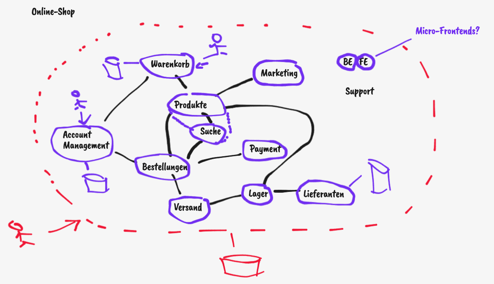

# Account Service Sample

[Folien](REST.pdf)

Wir haben diese Microservices-Architektur konzipiert:

Darauf basierend haben wir unsere REST-API für den _AccountService_ designt:
 - [Formlos](docs/accountservice.md)
 - [OpenAPI](openapi.yml)